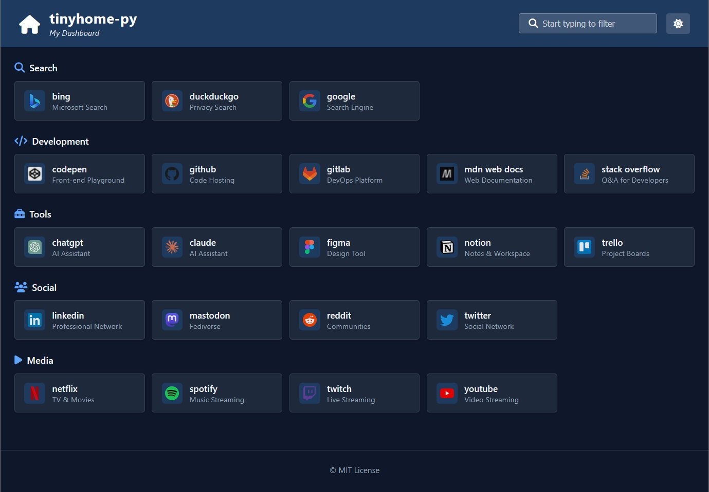

# tinyhome-py

A minimal, modern dashboard generator. Two files, no dependencies, beautiful output.

Inspired by [bderenzo/tinyhome](https://github.com/bderenzo/tinyhome) — a brilliant shell-based static homepage generator — and [Dashy](https://dashy.to/) — a feature-rich self-hosted dashboard. This Python rewrite combines tinyhome's simplicity with a Dashy-inspired UI, adding dark mode, live search, flexible icons, and INI configuration.

Perfect for homelabs, internal intranets, self-hosted dashboards, or anywhere you need a clean landing page for your links.


<p align="center">
  
  
</p>

## Features

- **Single Python script** — no frameworks, no build tools
- **INI config file** — cleaner than CSV, easy to read and edit
- **Dark/light mode** — toggle button + respects system preference
- **Live search filter** — instantly filter cards as you type
- **Auto-sorted sections** — items alphabetized automatically
- **Responsive grid** — works on desktop and mobile
- **Modern UI** — clean cards with subtle hover effects
- **Flexible icons** — Font Awesome, Dashboard Icons, Simple Icons, favicons, emojis, or custom URLs
- **Optional descriptions** — add context to any link
- **Customizable header** — title, subtitle, and logo
- **Customizable footer** — add copyright, contact info, etc.
- **Zero local assets** — fonts and icons load from CDN

## Quick Start

```bash
# Generate the dashboard
./tinyhome.py > index.html

# Or specify a different config
./tinyhome.py myconfig.ini > index.html
```

Open `index.html` in your browser. That's it.

## Configuration

Edit `config.ini` to customize your dashboard:

```ini
[settings]
title = My Dashboard
subtitle = Intranet of Things
logo = server
footer = © 2025 My Company

[Development]
icon = code
GitHub = hl-github, https://github.com, Code Hosting
GitLab = hl-gitlab, https://gitlab.com, DevOps Platform
Stack Overflow = hl-stackoverflow, https://stackoverflow.com, Q&A for Developers

[Tools]
icon = toolbox
Claude = hl-claude, https://claude.ai, AI Assistant
Notion = hl-notion, https://notion.so, Notes & Workspace
```

### Config format

```
[settings]
title = Dashboard Title
subtitle = Optional subtitle (italic, under title)
logo = icon-for-header
footer = Optional footer text

[Section Name]
icon = section-icon
Link Name = icon, https://example.com, Optional description
```

## Icons

Multiple icon sources are supported:

| Prefix | Example | Source |
|--------|---------|--------|
| `hl-` | `hl-zabbix`, `hl-proxmox`, `hl-idrac` | [Dashboard Icons](https://github.com/walkxcode/dashboard-icons) |
| `si-` | `si-zabbix`, `si-cloudflare` | [Simple Icons](https://simpleicons.org) |
| `mdi-` | `mdi-server`, `mdi-network` | Material Design Icons |
| `url` | `url https://example.com/icon.png` | Direct URL |
| `favicon` | `favicon google.com` | Auto-grab site favicon |
| `emoji` | `emoji 🚀` | Emoji |
| `fab` | `fab github`, `fab youtube` | Font Awesome Brands |
| `fas` | `fas server`, `fas code` | Font Awesome Solid |
| *(default)* | `server`, `code`, `toolbox` | Font Awesome Solid |

### Icon resources

- **Dashboard Icons** (recommended for homelab): [Browse PNG icons](https://github.com/walkxcode/dashboard-icons/tree/main/png)
- **Simple Icons** (brand logos): [simpleicons.org](https://simpleicons.org)
- **Font Awesome**: [fontawesome.com/icons](https://fontawesome.com/icons)

## Example config.ini

```ini
[settings]
title = tinyhome-py
subtitle = My Dashboard
logo = home
footer = © MIT License

[Search]
icon = magnifying-glass
Google = hl-google, https://www.google.com, Search Engine
DuckDuckGo = hl-duckduckgo, https://duckduckgo.com, Privacy Search

[Development]
icon = code
GitHub = hl-github, https://github.com, Code Hosting
GitLab = hl-gitlab, https://gitlab.com, DevOps Platform
Stack Overflow = hl-stackoverflow, https://stackoverflow.com, Q&A for Developers
MDN Web Docs = hl-mdn, https://developer.mozilla.org, Web Documentation

[Tools]
icon = toolbox
ChatGPT = hl-chatgpt, https://chat.openai.com, AI Assistant
Claude = hl-claude, https://claude.ai, AI Assistant
Notion = hl-notion, https://notion.so, Notes & Workspace
Trello = hl-trello, https://trello.com, Project Boards

[Social]
icon = users
Reddit = hl-reddit, https://reddit.com, Communities
Twitter = hl-twitter, https://twitter.com, Social Network
LinkedIn = hl-linkedin, https://linkedin.com, Professional Network

[Media]
icon = play
YouTube = hl-youtube, https://youtube.com, Video Streaming
Spotify = hl-spotify, https://spotify.com, Music Streaming
Twitch = hl-twitch, https://twitch.tv, Live Streaming
```

## Requirements

- Python 3.x (standard library only)
- Internet connection (for CDN fonts/icons)

## Files

```
tinyhome/
├── tinyhome.py    # Dashboard generator
├── config.ini     # Your links and settings
├── index.html     # Generated output
└── README.md
```

## Credits

- Original concept: [bderenzo/tinyhome](https://github.com/bderenzo/tinyhome)
- UI inspiration: [Dashy](https://dashy.to/)
- Icons: [Font Awesome](https://fontawesome.com), [Dashboard Icons](https://github.com/walkxcode/dashboard-icons), [Simple Icons](https://simpleicons.org)
- Font: [Segoe UI](https://learn.microsoft.com/en-us/typography/font-list/segoe-ui)

## License

MIT
